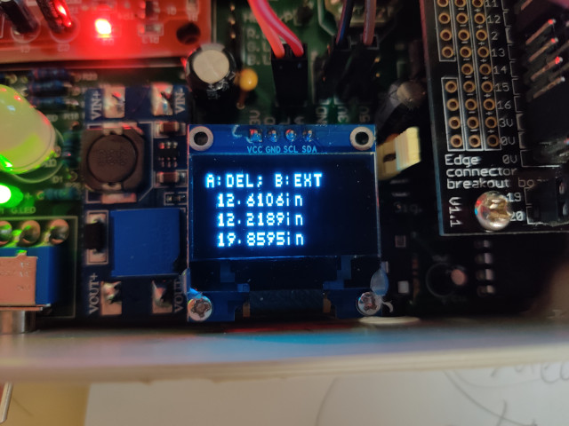

# ssd1306_mecronomit
A memory-economic text-based driver of the OLCD screen SSD1306 for microbit written in Python.  This program effectively turns the low-cost SSD1306 128x64 or 128x32 OLED into a 16x4 text display. 

## Acknowledgement

A small portion of code in this project is adapted from <https://github.com/fizban99/microbit_ssd1306>.  These portion, based on our judgement, fells into the category of fair use. 

## Hardware setup

Connect SCL to pin 19 and SDA to pin 20. 

## Usage

There are two files `ssd1306h.py` and `ssd1306hr.py`.  Both files contain the same group of functions, but the latter is a little faster, a little more memory efficient and harder to read. 

Do not expect this library to be fast, this is the cost you need for a memory efficient library.  We use the bitmap built-in Micro:bit for text information. 

The function `initialize()` shall always be called before every other operation. 

The function `clear_oled()` clean everything displayed on the LED, usually this should be called right after `initialize()`. 

The function `put_text(row, text, init_pos=0)` put `text` onto to the `row`-th row (counted from 0).  If `init_pos` is set, the function will write things from `init_pos` and it will not override existing characters on the screen before the `init_pos`.

The function `add_text()` is an adapter for those who use the method with the same name from <https://github.com/fizban99/microbit_ssd1306>

## Notes

Clear the screen before you put any text.  It doesn't matter if you want to override some characters using other character, but you should not try to override images by characters.


## Demo

The screen shows

```
A: DEL; B:EXT
 12.6106in
 12.2189in
 19.8595in
```


